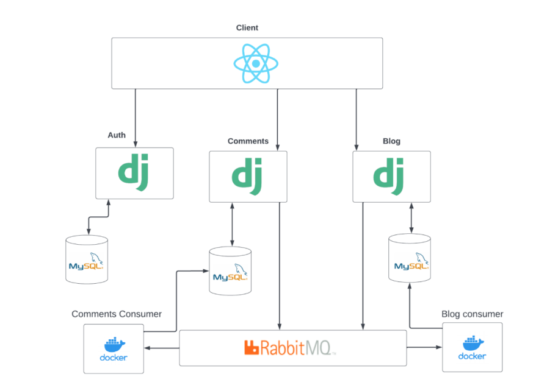

# blog microservices

---

This project is a simple blog application built with a microservices architecture to explore distributed systems, message queuing with RabbitMQ, and containerization using Docker. The application is designed to allow admins (writers) to create, edit, and delete articles, while users can view, like, and comment on those articles. Additionally, tags can be added to articles to help users discover related content.

### Features

- **Admin Functionality** : Admins can manage articles by creating, editing, deleting, and tagging them.
- **User Interaction** : Registered users can like or comment on any article, while all users can browse articles.
- **Authentication** : JSON Web Token (JWT) is used for secure and stateless authentication, allowing each microservice to verify the user's identity without having to communicate with a central authentication service for every request.

### Why Microservices?

Although microservices may seem like an over-engineered solution for a small application, the goal of this project is to demonstrate how a microservices architecture can be applied in real-world applications. By splitting the application into multiple services, we aim to show how this architecture:

### Architecture Overview

The application is divided into several microservices:

- **User Service** : Manages user authentication, registration, and login.
- **Article Service** : Handles article creation, editing, deletion, and tagging.
- **Interaction Service** : Manages user interactions with articles, such as liking and commenting.

### Communication

RabbitMQ: RabbitMQ is used as the message broker to facilitate asynchronous communication between microservices. Each service can push messages into the queue, and other services can pull and process these messages as needed. This approach decouples services and allows for more scalable and fault-tolerant communication.

### How to Run

Clone the repository.
Ensure Docker and Docker Compose are installed on your system.
Use docker-compose up to start the application. This command will build and run the necessary services and databases.
Access the application via the provided endpoints.
This project serves as a foundational exploration of microservices, container orchestration, and inter-service communication. It can be expanded further for more complex use cases.

[Project Report](https://drive.google.com/file/d/1VPp4NtT7GwNjRiaTnmsuvKv3MIp5Aq7o/view?usp=sharing)
